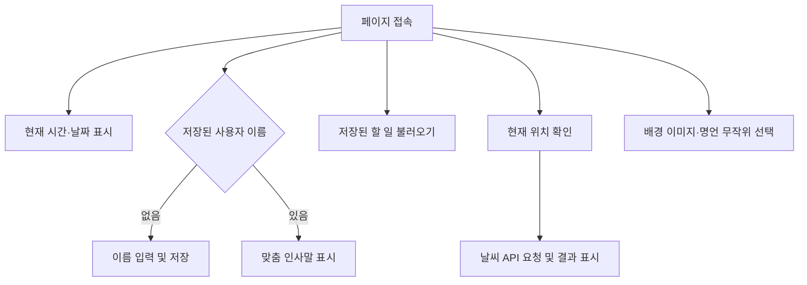

# Momentum Clone

> 실시간 정보와 개인 할 일을 한 화면에서 확인할 수 있도록 만든 바닐라 JavaScript 기반 브라우저 대시보드입니다.

---

## 프로젝트 소개

Momentum Clone은 현재 시간과 날짜, 사용자별 인사말, 할 일 목록, 랜덤 명언과 배경 이미지, 현재 위치의 날씨를 한 화면에 제공하는 개인 대시보드입니다. HTML·CSS·JavaScript만으로 화면을 구성하고, 브라우저 저장소와 외부 API를 연동해 새로고침 후에도 사용자 정보와 할 일이 유지되도록 구현했습니다.

- 개발 형태: 개인 프로젝트
- 담당 역할: 화면 구성, 기능 구현, 외부 API 연동
- 주요 기술: HTML5 · CSS3 · JavaScript · Local Storage · Geolocation API · OpenWeatherMap API

---

## 기획 배경 및 목표

JavaScript의 DOM 조작과 이벤트 처리 방식을 익히고, 브라우저가 제공하는 저장소 및 위치 정보 기능을 실제 웹페이지에 적용하는 것을 목표로 제작했습니다. 단순한 기능 실습에 그치지 않고 시간, 일정, 날씨처럼 자주 확인하는 정보를 하나의 대시보드에서 사용할 수 있도록 구성했습니다.

---

## 주요 기능

| 기능                | 설명                                                                                                      |
| ------------------- | --------------------------------------------------------------------------------------------------------- |
| 실시간 시계 및 날짜 | `Date` 객체와 `setInterval()`을 사용해 현재 시각을 1초 단위로 갱신하고 날짜와 요일을 표시합니다.          |
| 사용자 인사말       | 사용자가 입력한 이름을 Local Storage에 저장하고, 재접속 시 저장된 이름을 불러와 맞춤 인사말을 표시합니다. |
| 할 일 관리          | 할 일을 추가·삭제할 수 있으며, 목록을 JSON 형식으로 Local Storage에 저장해 새로고침 후에도 유지합니다.    |
| 현재 위치 기반 날씨 | Geolocation API로 위도와 경도를 받아 OpenWeatherMap API에 요청하고, 현재 지역·날씨·기온을 표시합니다.     |
| 랜덤 배경 이미지    | 페이지를 열 때 준비된 이미지 중 하나를 무작위로 선택해 배경으로 적용합니다.                               |
| 랜덤 명언           | 미리 정의한 명언 목록에서 하나를 무작위로 선택해 화면 하단에 표시합니다.                                  |

---

## 동작 흐름



---

## 구현 내용

### 1. Local Storage를 활용한 상태 유지

- 사용자 이름을 문자열로 저장해 재접속 시 입력 과정을 생략했습니다.
- 할 일 목록은 객체 배열로 관리하고 `JSON.stringify()`와 `JSON.parse()`를 이용해 저장·복원했습니다.
- 각 할 일에 `Date.now()` 기반 ID를 부여해 선택한 항목만 삭제할 수 있도록 구현했습니다.

### 2. 브라우저 Web API 연동

- Geolocation API로 사용자의 현재 좌표를 가져왔습니다.
- Fetch API를 통해 OpenWeatherMap에 비동기 요청을 보내고 응답 JSON에서 도시명, 날씨, 기온을 추출했습니다.
- 위치 정보 제공에 실패한 경우 오류 메시지를 안내하도록 처리했습니다.

### 3. DOM 조작을 통한 동적 화면 구성

- 사용자 로그인 여부에 따라 입력 폼과 인사말의 표시 상태를 전환했습니다.
- JavaScript로 할 일 요소와 삭제 버튼을 생성하고 이벤트 리스너를 연결했습니다.
- 랜덤으로 선택된 이미지를 `` 요소로 생성해 페이지 배경에 추가했습니다.

---

## 기술 스택

| 구분         | 기술               | 활용 내용                                       |
| ------------ | ------------------ | ----------------------------------------------- |
| Markup       | HTML5              | 대시보드 화면 및 입력 폼 구조 구성              |
| Styling      | CSS3               | 요소 배치, 배경 이미지, 할 일 목록 스타일링     |
| Language     | JavaScript         | DOM 조작, 이벤트 처리, 데이터 관리, 비동기 통신 |
| Browser API  | Local Storage      | 사용자 이름과 할 일 목록 저장                   |
| Browser API  | Geolocation API    | 사용자 현재 위치의 위도·경도 조회               |
| External API | OpenWeatherMap API | 현재 지역의 날씨 및 기온 조회                   |
| Deployment   | GitHub Pages       | 정적 웹페이지 배포                              |

---

## 프로젝트 구조

```text
seohyun.github.io-master/
├── index.html
├── css/
│   └── style.css
├── img/
│   ├── aurora.jpg
│   ├── dawn.jpg
│   └── nightview.jpg
└── js/
    ├── backgroud.js
    ├── clock.js
    ├── greetings.js
    ├── quotes.js
    ├── todo.js
    └── weather.js
```

---

## 트러블슈팅

### 새로고침 시 사용자 정보와 할 일 목록이 초기화되는 문제

#### 문제 상황

사용자가 이름과 할 일을 입력해도 페이지를 새로고침하면 모든 정보가 사라지는 문제가 발생했습니다.

#### 원인

입력 데이터를 JavaScript 변수와 배열에만 저장하고 있어, 페이지가 새로고침되면서 실행 상태가 초기화되는 것이 원인이었습니다.

#### 해결 방법

브라우저를 종료하거나 페이지를 새로고침해도 데이터를 유지할 수 있도록 Local Storage를 적용했습니다.

사용자 이름은 문자열 형태로 저장했습니다.

```javascript
localStorage.setItem("username", username);
```

할 일 목록은 객체 배열이므로 JSON.stringify()를 사용해 문자열로 변환한 뒤 저장했습니다.

```javascript
localStorage.setItem("todos", JSON.stringify(toDos));
```

페이지가 다시 실행될 때는 저장된 데이터를 불러오고, 할 일 목록은 JSON.parse()를 사용해 다시 배열로 변환했습니다.

```javascript
const savedToDos = localStorage.getItem("todos");

if (savedToDos !== null) {
  const parsedToDos = JSON.parse(savedToDos);
  toDos = parsedToDos;
  parsedToDos.forEach(paintToDo);
}
```

#### 결과

페이지를 새로고침하거나 다시 접속해도 사용자 이름과 할 일 목록이 유지되도록 개선했습니다. 이 과정을 통해 JavaScript의 실행 상태와 브라우저 저장소의 차이를 이해하고, 객체 배열을 저장하기 위한 JSON 직렬화·역직렬화 방법을 익혔습니다.

---

## 실행 방법

별도의 빌드 과정 없이 정적 파일을 실행할 수 있습니다. 저장소를 내려받은 뒤 VS Code의 Live Server 등 로컬 웹 서버로 `index.html`을 열어주세요.

```bash
git clone <repository-url>
cd seohyun.github.io-master
```

날씨 기능을 사용하려면 OpenWeatherMap API 키가 필요하며, 브라우저에서 위치 정보 사용을 허용해야 합니다.

---

## 개선 방향

- 공개 저장소에 노출되지 않도록 기존 날씨 API 키를 재발급하고, 도메인 제한 또는 별도 프록시 서버를 적용해 키를 보호합니다.
- API 요청 실패·위치 권한 거부·네트워크 오류 상황을 화면에서 구분해 안내합니다.
- 사용자 이름 수정 및 전체 할 일 초기화 기능을 추가합니다.
- 모바일 화면에서도 사용하기 쉽도록 반응형 레이아웃과 접근성을 보완합니다.
- 할 일 완료 상태, 마감일, 우선순위 등 일정 관리 기능을 확장합니다.

---

## 회고

이 프로젝트를 통해 JavaScript로 화면 요소를 선택하고 변경하는 방법뿐 아니라, 이벤트에 따라 데이터를 갱신하고 브라우저 저장소에 상태를 유지하는 전체 흐름을 익혔습니다. 또한 Geolocation API와 외부 날씨 API를 연결하면서 비동기 요청과 JSON 응답 처리 과정을 실제 기능으로 구현해볼 수 있었습니다.
